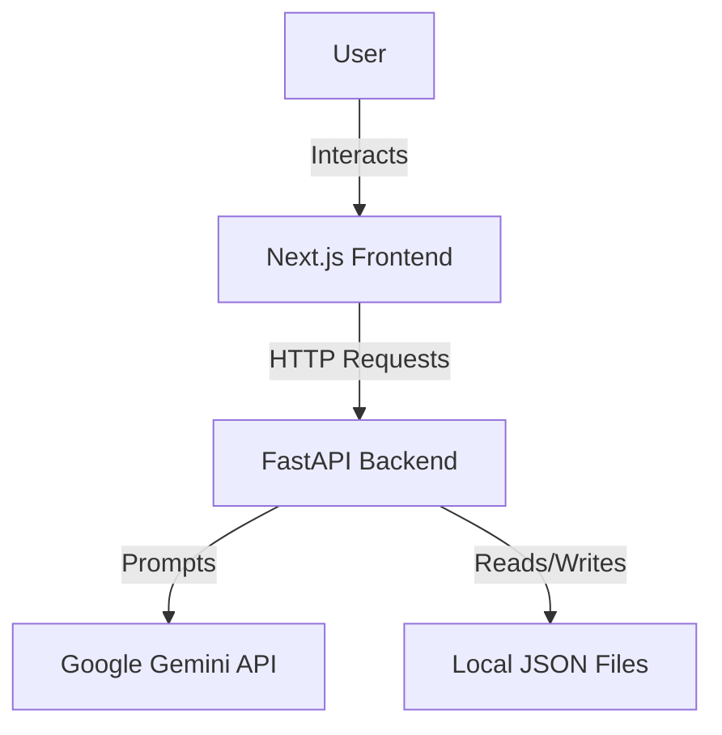

# Architecture Overview

The application follows a standard Client-Server architecture.

## High-Level Diagram

## detailed Components

### Frontend (Next.js)

-   **Pages**:
    -   `/`: Home / Start Interview.
    -   `/projects`: Project Manager Dashboard.
-   **Components**:
    -   `StartForm`: Initial configuration (Idea, Phases, Question Count).
    -   `QuestionCard`: Displays current question and options.
    -   `SummarySection`: Shows chat history and conversation summary.
    -   `ResultSection`: Renders the final generated prompt (Markdown).
-   **State Management**: React `useState` for local state. URL Query params (`?load=ID`) for routing.

### Backend (FastAPI)

-   **API Layer**: `main.py` defines REST endpoints.
-   **Service Layer**: `llm_service.py` handles interaction with Google Gemini.
    -   Manages prompt construction.
    -   Parses LLM responses (JSON enforcement).
-   **Data Layer**: Simple JSON file storage in `backend/saves/`.
    -   Each session is a JSON file named `{timestamp}.json`.

## Data Flow

1.  User submits idea.
2.  Frontend sends `POST /generate-question` (initially empty history).
3.  Backend constructs a prompt for Gemini, asking for the *next* logical question based on selected *Project Phases*.
4.  Gemini returns a question + options.
5.  Frontend displays question.
6.  User answers.
7.  Frontend appends answer to history and repeats loop.
8.  When complete, Frontend sends `POST /generate-prompt`.
9.  Backend sends full history to Gemini to synthesize a "Master Prompt".
